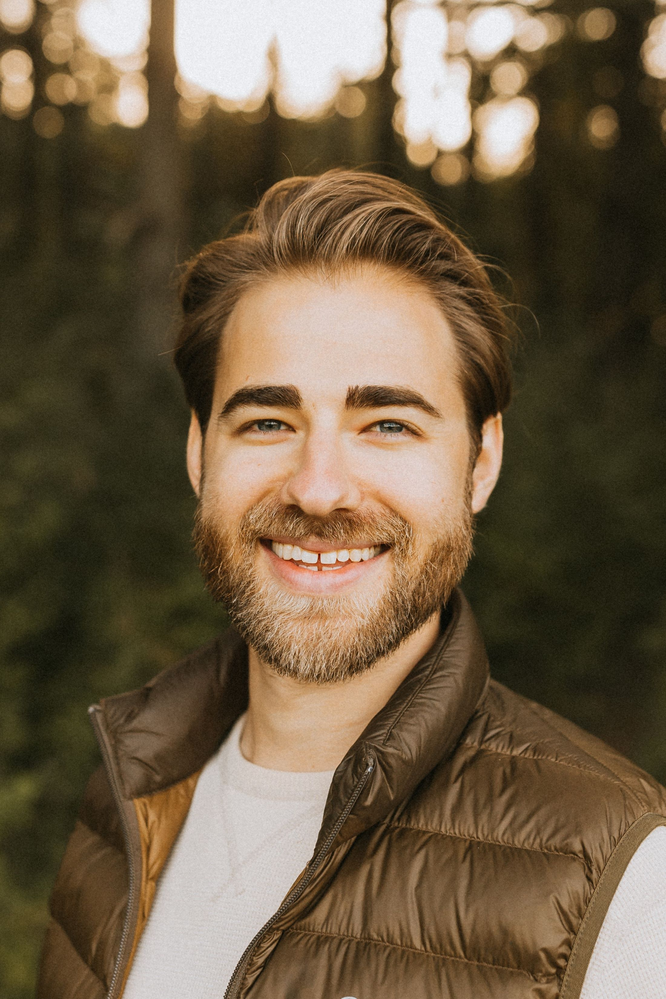

 width = "4" height = "6"

### Education
[Ph.D., Crop Production & Physiology](https://www.parchment.com/u/award/1dfdbd7a04f54be8b4c26f9933e35167) - 2025  
Minor in Statistics  
[Graduate Certificate in Data-Driven Food, Energy, and Water Systems](https://www.parchment.com/u/award/c1d82caccb621a16ee6f7557b26b01ec) - [DataFEWSion](https://datafewsion.iastate.edu/)  
Iowa State University

M.S., Soil Science (Soil Management) - 2020  
Iowa State University

B.S., Agricultural Biochemistry - 2015  
Iowa State University

### Research Interests
My research interests include soil fertility, experimental design, nonlinear modeling, statistics, and crop physiology.

### Resume
[Resume](assets/docs/Cleveringa_resume_pagedown.pdf)
### CV
[CV](assets/docs/CV_Cleveringa.pdf)

### Presentations
##### Dissertation defense - 2025
[Watch](https://youtu.be/msS_phhWQY0?si=2e5_enm9569vtoIo)
##### Oral Presentation from ASA 2024 - San Antonio
[Losing Control: What happens when we exclude the control treatment in nitrogen fertilizer rate trials?](https://scisoc.confex.com/scisoc/2024am/meetingapp.cgi/Paper/157192)
##### Poster from ASA 2023 - St. Louis
[Can We Identify Covariates Using Absolute Yield for Fertilizer Recommendations?](assets/img/StLouis_poster.pdf)
##### Poster from ASA 2022 - Baltimore
[Absolute Yield Instead of Relative Yield for Fertilizer Recommendations?](assets/img/Baltimore_poster.pdf)

### Publications  
**Cleveringa, A. M.**, dos Santos, C. L., Miguez, F. E. (2025). Introducing the Quadratic-Plateau-Quadratic Function: Capturing the Ups and Downs [In Review]. Department of Agronomy, Iowa State University.

**Cleveringa, A. M.**, Ransom, C. J., McDaniel, M. D., Moore, K. J., Niemi, J. B., Miguez, F. E. (2025). Losing control: What happens when the control treatment is excluded in nitrogen fertilizer rate trials? [Accepted]. Department of Agronomy, Iowa State University.

**Cleveringa, A. M.** (2025). Soil fertility trials on trial for "noise": statistical implications for soil fertility modeling (Doctoral dissertation, Iowa State University).  
[Dissertation](https://www.proquest.com/docview/3244659768?pq-origsite=gscholar&fromopenview=true&sourcetype=Dissertations%20&%20Theses)  

Laurent, A. C., **Cleveringa, A. M.**, Fey, S., Kyveryga, P., Wiese, N., Lefebvre, M., Newville, D., Quinn, D., McGuire, J., Tao, H., Morris, T., & Miguez, F. E. (2023). Late-season corn stalk nitrate measurements across the US Midwest from 2006 to 2018. Scientific Data, 10(1), 192.  
[Article](https://www.nature.com/articles/s41597-023-02071-9), [Data](https://www.sidalc.net/search/Record/dat-usda-us-article24668283/Description)  

**Cleveringa, A. M.** (2020). Short-term effects of integrated tillage systems and cover crop on agronomic response and soil health in North Central Iowa (Master's thesis, Iowa State University).  
[Thesis](https://www.proquest.com/docview/2480780213?pq-origsite=gscholar&fromopenview=true&sourcetype=Dissertations%20&%20Theses)  

### Projects  
#### ONFANT
ONFANT, ON-FArm Nitrogen Trials, is a web-based interactive tool to visualize and summarize historical on-farm replicated strip trial data conducted by farmers working with the Iowa Soybean Association (see tab “Replicated strip trials”) and guided corn nitrate survey fields data across the Midwest (see tab “corn stalk N surveys”).  
[Link](https://onfant.agron.iastate.edu/)  
##### Losing Control  (Coming soon!)
##### QPQ Model  (Coming soon!)
